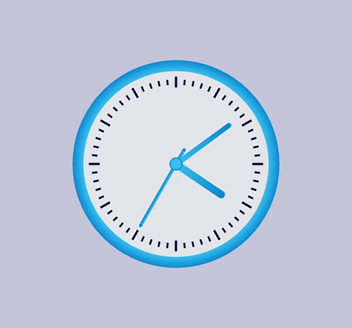

# Wall-clock
A 3D model of a wall clock that mirrors local time of the computer.   
This project was coded in **C++** using  **openGL** and **GLUT**

# Demo

>Use **'A'** key to toggle axes   
Use **Arrow keys** to change projection angle.

# Development tool

- **Codeblocks-20.03** text editor was used for coding.

# References
- Setting up codeblocks -- [Click here](https://www.youtube.com/watch?v=ek4Jmh0Fuko&t=2s&ab_channel=Newb.python)   
- OpenGL tutorials -- [Click here](https://www.youtube.com/watch?v=QO4NTBWJQLg&list=PL2330214740B33712&ab_channel=DavidParker)
   
     
---
# Happy coding !